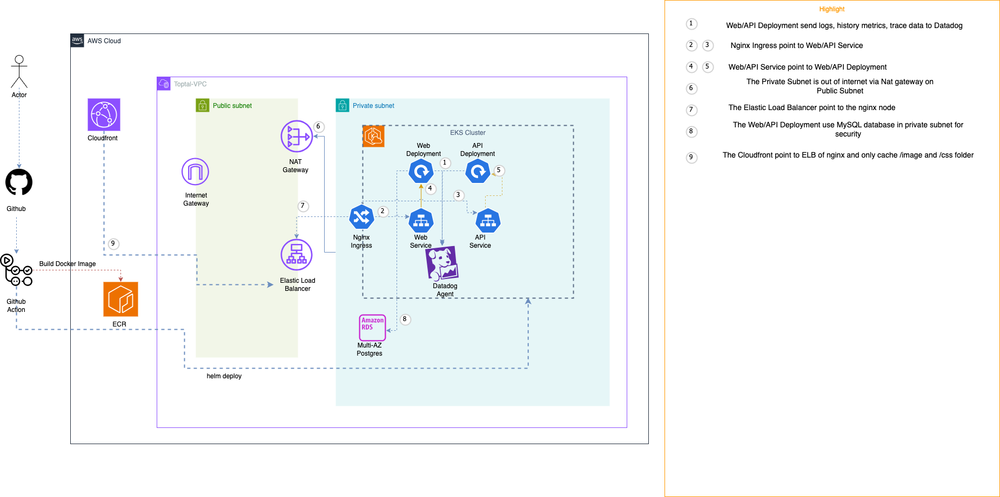

## Introduction

This is document to help to deploy and maintaint the toptal three tier web application. The document include to create resource by terraform, how the CI/CD work and what had been observation

## Diagram



## How to create infrastructure

The IaC using terragrunt to simplify the repeatable of backend terraform state and provider in multiple folder. To create resouce do the step below
1. `cd infra`
2. First create VPC: `cd vpc; terragrunt apply`
3. Then create ecr, eks, db resource follow order by `cd ${resource}; terragrunt apply`

## How to test on local

The repo include a docker-compose where eveything needed for local test was included. Just run `docker-compose up` and the root folder
$ docker-compose up

The web and api will created and listening on port 5000/8000

## Helm chart

1. In folder deploy, the helm chart for web/api had been created with value file so that the CI/CD can deploy with one command helm
```

└── 3tier-app2
    ├── Chart.yaml
    ├── templates
    │   ├── api
    │   │   ├── deployment.yaml
    │   │   ├── hpa.yaml
    │   │   ├── ingress.yaml
    │   │   ├── service.yaml
    │   │   └── serviceaccount.yaml
    │   └── web
    │       ├── deployment.yaml
    │       ├── hpa.yaml
    │       ├── ingress.yaml
    │       ├── service.yaml
    │       └── serviceaccount.yaml
    └── values.yaml
```

## CI/CD workflow

1. Developer merge to master the code that had been changed in web/api folder
2. The github action detect the change in folder with branch master
3. Github action build web/api image and push to ECR
4. The deploy job will check if the build job success and start deploy to EKS with github action helm deploy action

## Observation

1. The web/api send logs/metrics to Datadog SAAS which only for docker image with name contain api or web (to save cost)
2. The trace also enabled to automatically add trace information to Datadog

## Autoscaling

1. Web/API deployment had been enabled HPA to scale base on memory/cpu
2. The Cluster Autoscaler also enabled to auto scale worker-node base on API/Web pods pending status
